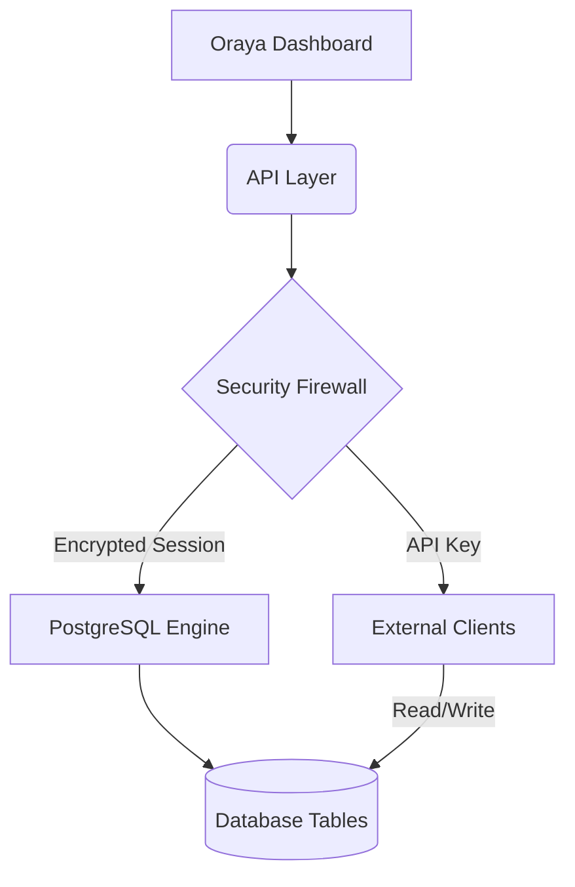

# 🪐 Oraya Database

[](https://github.com/Hyd3dF/Oraya-Database)
[](./LICENSE)
[](./NOTICE)
[](https://vercel.com/new/clone?repository-url=https://github.com/Hyd3dF/Oraya-Database)

**Oraya Database** is a premium, full-stack PostgreSQL management engine designed for developers who demand high-level data governance and a seamless interface. It bridges the gap between raw database power and modern web aesthetics.

---

## ⚡ The Oraya Advantage

| Feature | Description | Status |
| :--- | :--- | :--- |
| **Encrypted Sessions** | AES-256-GCM encrypted persistence for DB credentials. | ✅ Stable |
| **Schema Forge** | Visual table architect with advanced constraint management. | ✅ Hub |
| **Data Flux** | High-performance, paginated data explorer with real-time feedback. | ✅ Stable |
| **API Gateway** | Secure, SQLite-backed endpoint manager for external clients. | ✅ Beta |
| **Glassmorphism UI** | Premium dark-mode interface built on Shadcn & Inter. | ✅ Active |

---

## 🏗️ Architecture

Oraya is built on a "Service-Oriented" architecture within the Next.js App Router, ensuring strict separation of concerns and maximum security.



---

## 📜 The Oraya Social Contract (Public Domain Rules)

Oraya Database is dedicated to the public domain while maintaining a strictly protected identity.

> [!CAUTION]
> **COMPLIANCE IS MANDATORY**
> 1. **Zero Monetization**: You may NOT sell this software, its components, or modified versions. Access must always be free.
> 2. **Immaculate Branding**: The "Oraya Database" name must be clearly displayed in all derivative works. Replacement of the name is prohibited.
> 3. **Open Continuity**: If you modify the code, you MUST contribute those changes back to the community under the same "Oraya" terms.

Read the full [RULES.md](./RULES.md) to avoid legal infringement.

---

## 🚀 Quick Start

### 1. Installation
```bash
git clone https://github.com/Hyd3dF/Oraya-Database.git
cd Oraya-Database
npm install
```

### 2. Configuration
Create a `.env.local` file in the root directory:
```bash
# Required for session encryption
DB_COOKIE_SECRET=your_32_character_ultra_secret_key
```

### 3. Execution
```bash
npm run dev
```
Navigate to [http://localhost:3000](http://localhost:3000) to begin.

---

## 🤝 Contributing & Community

We believe in the power of open collaboration. If you have ideas for Oraya, please review our [CONTRIBUTING.md](./CONTRIBUTING.md).

---

## 📄 License

Oraya Database uses a **Hybrid AGPL-3.0 + Non-Commercial Agreement**. 
See the [LICENSE](./LICENSE) and [NOTICE](./NOTICE) for full legal text.

**Oraya Database — Data with Integrity. Identity with Honor.**
