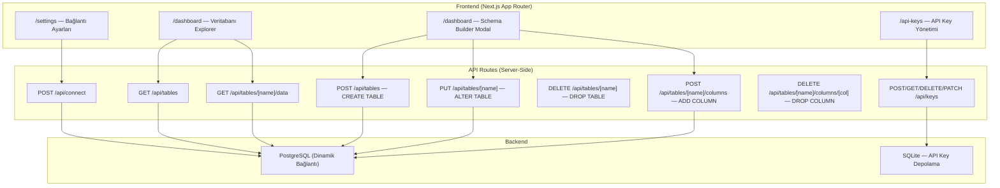
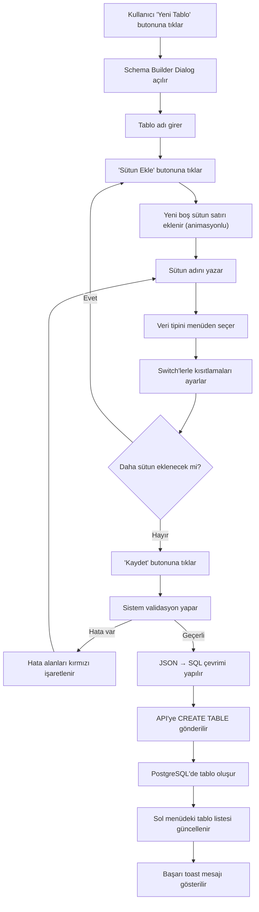

# Kişisel Veritabanı Yönetim Paneli — Implementation Plan v2

Sıfırdan, Next.js App Router + TypeScript + Tailwind CSS + Shadcn UI + pg ile Apple kalitesinde minimalist bir PostgreSQL yönetim paneli. **Artık sadece okuma değil, görsel tablo & şema oluşturma motoru da dahil.**

## Mimari Genel Bakış



---

## Proposed Changes

### 1. Proje İskeleti

#### [NEW] Proje Kurulumu
- `npx create-next-app@latest ./ --typescript --tailwind --eslint --app --src-dir --import-alias "@/*"` ile proje oluşturulacak
- Shadcn UI init: `npx shadcn@latest init` (New York stili, Zinc base renk, CSS variables: Evet)
- Shadcn bileşenleri: `button`, `input`, `label`, `card`, `table`, `dialog`, `badge`, `toast`, `separator`, `dropdown-menu`, `tooltip`, `tabs`, `skeleton`, `switch`, `select`, `sheet`, `scroll-area`, `popover`, `alert-dialog`
- `pg` paketi: `npm install pg @types/pg`
- `uuid` paketi: `npm install uuid @types/uuid`
- `better-sqlite3`: `npm install better-sqlite3 @types/better-sqlite3`

---

### 2. Global Tasarım Sistemi

#### [MODIFY] `src/app/globals.css`
- Apple-inspired renk paleti: Soft beyaz (#FAFAFA) arka plan, warm gri tonları, mavi accent (#007AFF)
- SF Pro benzeri tipografi (Inter font)
- Minimal gölgelendirme: soft `box-shadow` tonları
- iOS-style radius: `rounded-xl`
- Pürüzsüz geçişler: `transition-all duration-200 ease-out`

#### [MODIFY] `src/app/layout.tsx`
- Inter Google Font
- Sol sidebar navigasyon (Settings, Dashboard, API Keys)
- Sidebar: Cam efekt (`backdrop-blur-xl`), sabit, 260px
- Bağlantı durumu göstergesi sidebar alt kısmında

---

### 3. Bağlantı Yönetimi (Core)

#### [NEW] `src/lib/db.ts`
- Dinamik PostgreSQL bağlantı yöneticisi
- Bağlantı bilgileri sunucu taraflı encrypted cookie
- Connection pooling
- Bağlantı durumu kontrolü (ping)

#### [NEW] `src/app/api/connect/route.ts`
- `POST` — Bağlantı bilgilerini al, test et, cookie'ye kaydet
- `DELETE` — Bağlantıyı sonlandır
- `GET` — Mevcut bağlantı durumu

---

### 4. Settings Sayfası

#### [NEW] `src/app/settings/page.tsx`
- 5 alan: Host, Port, User, Password, Database Name
- Bağlantı durumu göstergesi (yeşil/kırmızı dot + pulse animasyonu)
- "Bağlan" / "Bağlantıyı Kes" butonları
- Loading state, toast mesajları

#### [NEW] `src/components/connection-form.tsx`
- Kontrollü form, validasyon
- Apple-style input: hafif border, büyük padding, yumuşak focus ring

---

### 5. Dashboard / Explorer Sayfası

#### [NEW] `src/app/dashboard/page.tsx`
- Sol panel: Tablo listesi + **"Yeni Tablo" butonu** (üst kısımda)
- Sağ panel: Seçili tablonun verileri VEYA Schema Builder
- Bağlantı yoksa → Settings'e yönlendirme

#### [NEW] `src/app/api/tables/route.ts`
- `GET` — `information_schema.tables` sorgusu ile public tablolar
- `POST` — **CREATE TABLE** (Schema Builder'dan gelen tanımı SQL'e çevirir)

#### [NEW] `src/app/api/tables/[name]/route.ts`
- `GET` — Tablo şema bilgisi (`information_schema.columns` sorgusu)
- `PUT` — **ALTER TABLE** (tablo adı değiştirme)
- `DELETE` — **DROP TABLE** (onay gerektiren)

#### [NEW] `src/app/api/tables/[name]/data/route.ts`
- `GET` — Seçili tablonun verilerini döndür (sayfalama: offset/limit)
- SQL injection koruması (parameterized queries)

#### [NEW] `src/app/api/tables/[name]/columns/route.ts`
- `POST` — **ADD COLUMN** (yeni sütun ekleme)
- `PUT` — **ALTER COLUMN** (sütun tipini/kısıtlamalarını değiştirme)

#### [NEW] `src/app/api/tables/[name]/columns/[column]/route.ts`
- `DELETE` — **DROP COLUMN** (sütun silme)

---

### 6. ⭐ Görsel Schema Builder (YENİ — Ana Özellik)

Bu, uygulamanın kalbi. Kullanıcı hiç SQL yazmadan, lego birleştirir gibi tıkla-seç mantığıyla tablolar oluşturabilecek.

#### [NEW] `src/components/schema-builder/schema-builder-dialog.tsx`
- Shadcn `Dialog` üzerine kurulu tam ekran modal
- İki modda çalışır: **Yeni Tablo Oluştur** & **Mevcut Tabloyu Düzenle**
- Üstte: Tablo adı input alanı (slug formatında, otomatik lowercase + underscore)
- Ortada: Sütun listesi (dinamik, sürüklenebilir sıralama)
- Altta: "Kaydet" ve "İptal" butonları
- Kaydet'e basıldığında tüm görsel tanım JSON olarak API'ye gönderilir
- API bu JSON'u saf `CREATE TABLE` veya `ALTER TABLE` SQL'ine çevirir

#### [NEW] `src/components/schema-builder/column-row.tsx`
Her bir sütun satırı şu elemanları içerir:

| Eleman | Bileşen | Açıklama |
|--------|---------|----------|
| Sütun Adı | `Input` | Sütun ismini yazar (örn: `user_email`) |
| Veri Tipi | `Select` dropdown | UUID, TEXT, VARCHAR, INTEGER, BIGINT, BOOLEAN, TIMESTAMP, DATE, JSONB, FLOAT, SERIAL |
| Primary Key | `Switch` | Aç/kapat — aktif olduğunda otomatik NOT NULL |
| Unique | `Switch` | Aç/kapat |
| Not Null | `Switch` | Aç/kapat |
| Default Value | `Input` (koşullu) | Sadece bir default girilmek istenirse açılır. BOOLEAN için true/false seçici, TIMESTAMP için `now()` kısayolu |
| Sil | `Button` (trash icon) | Sütunu kaldırır (animasyonlu) |

#### [NEW] `src/components/schema-builder/column-type-select.tsx`
- Kategorize edilmiş veri tipi seçici
- Gruplar: **Metin** (TEXT, VARCHAR, CHAR), **Sayı** (INTEGER, BIGINT, FLOAT, SERIAL, BIGSERIAL), **Mantıksal** (BOOLEAN), **Tarih** (TIMESTAMP, DATE, TIME), **Diğer** (UUID, JSONB, BYTEA)
- Her tipin yanında küçük açıklama tooltip'i

#### [NEW] `src/components/schema-builder/constraint-switches.tsx`
- Primary Key, Unique, Not Null switch'leri tek bir satırda
- iOS-style toggle switch (Shadcn Switch bileşeni, mavi renk active state)
- Primary Key aktif edildiğinde Not Null otomatik aktif olur ve kilitlenir
- Birden fazla Primary Key seçilirse composite key uyarısı

#### [NEW] `src/lib/sql-generator.ts`
Bu dosya Schema Builder'ın **beyni**. Görsel seçimleri hatasız SQL'e çevirir:

```typescript
interface ColumnDefinition {
  name: string;
  type: PostgresDataType;
  isPrimaryKey: boolean;
  isUnique: boolean;
  isNotNull: boolean;
  defaultValue?: string;
}

interface TableDefinition {
  tableName: string;
  columns: ColumnDefinition[];
}

// Çıktı örnekleri:
// CREATE TABLE users (
//   id UUID PRIMARY KEY NOT NULL DEFAULT gen_random_uuid(),
//   email TEXT UNIQUE NOT NULL,
//   is_active BOOLEAN NOT NULL DEFAULT true,
//   created_at TIMESTAMP NOT NULL DEFAULT now()
// );
```

Fonksiyonlar:
- `generateCreateTableSQL(def: TableDefinition): string` — Tam CREATE TABLE sorgusu
- `generateAlterTableSQL(tableName: string, changes: SchemaChanges): string[]` — ALTER TABLE sorguları dizisi
- `generateAddColumnSQL(tableName: string, column: ColumnDefinition): string` — Tekil ADD COLUMN
- `generateDropColumnSQL(tableName: string, columnName: string): string` — DROP COLUMN
- `validateTableDefinition(def: TableDefinition): ValidationError[]` — İsim çakışması, boş alan, geçersiz tip kontrolü

#### [NEW] `src/hooks/use-schema-builder.ts`
- Schema Builder'ın tüm state yönetimi
- Sütun ekleme, silme, güncelleme
- Undo/Redo desteği (state history)
- Validasyon kontrolü (gerçek zamanlı)
- API'ye gönderme ve response işleme

#### Schema Builder UX Akışı:



---

### 7. API Key Yönetimi

#### [NEW] `src/lib/api-keys-db.ts`
- better-sqlite3 ile lokal depolama
- Tablo: `api_keys (id, key, name, created_at, is_active)`

#### [NEW] `src/app/api/keys/route.ts`
- `GET` — Tüm key'leri listele
- `POST` — Yeni key üret (UUID v4, `dbp_` prefix'li)
- `DELETE` — Key sil
- `PATCH` — Key aktif/pasif yap

#### [NEW] `src/app/api-keys/page.tsx`
- "Yeni Anahtar Üret" butonu
- Liste: ad, maskelenmiş değer, tarih, durum badge
- Kopyalama, silme, durumu değiştirme aksiyonları

#### [NEW] `src/components/api-key-card.tsx`
- Tek bir API key kartı

---

### 8. Ortak Bileşenler

#### [NEW] `src/components/sidebar.tsx`
- Ana navigasyon
- Aktif sayfa vurgusu
- Bağlantı durumu göstergesi

#### [NEW] `src/components/page-header.tsx`
- Sayfa başlığı + açıklama

#### [NEW] `src/components/data-table.tsx`
- Dinamik sütunlu modern tablo
- Skeleton loading, satır hover, boş durum

#### [NEW] `src/components/table-list.tsx`
- Tablo listesi sidebar bileşeni
- "Yeni Tablo" butonu en üstte

#### [NEW] `src/hooks/use-connection.ts`
- Bağlantı durumu custom hook

---

## User Review Required

> [!IMPORTANT]
> **Schema Builder — Mevcut Tablo Düzenleme**: Yeni tablo oluşturma kesin. Mevcut tabloları da düzenleme (sütun ekleme/silme/değiştirme) desteği eklensin mi? Bu ALTER TABLE operasyonları riskli olabilir (veri kaybı). Onay dialogu ekleriz ama yine de onayınızı istiyorum.

> [!IMPORTANT]
> **Tablo Silme**: Dashboard'dan tablo silme (DROP TABLE) özelliği eklensin mi? Çift onaylı (tablo adını yaz + onayla) güvenlik mekanizması ile.

> [!WARNING]
> **API Key Depolama**: API key'ler lokal SQLite veritabanında tutulacak. PostgreSQL'e bağlı olmadan da çalışır. Onay?

> [!IMPORTANT]
> **Arayüz Dili**: Türkçe mi İngilizce mi? Mevcut planda arayüz İngilizce label'lar ile tasarlandı ama Türkçe yapılabilir.

---

## Open Questions

1. **Tailwind CSS versiyonu**: v3 (stabil) mü v4 (yeni) mi?
2. **Bağlantı kalıcılığı**: Tarayıcı kapatınca bağlantı bilgileri silinsin mi yoksa localStorage'da kalsın mı?
3. **Sayfalama limiti**: Varsayılan 100 satır uygun mu?

---

## Dosya Yapısı Özeti

```
src/
├── app/
│   ├── layout.tsx                          # Ana layout + sidebar
│   ├── page.tsx                            # → /settings'e redirect
│   ├── globals.css                         # Tasarım sistemi
│   ├── settings/
│   │   └── page.tsx                        # Bağlantı ayarları
│   ├── dashboard/
│   │   └── page.tsx                        # Explorer + Schema Builder
│   ├── api-keys/
│   │   └── page.tsx                        # API key yönetimi
│   └── api/
│       ├── connect/
│       │   └── route.ts                    # Bağlantı yönetimi
│       ├── tables/
│       │   ├── route.ts                    # GET tabloları / POST yeni tablo
│       │   └── [name]/
│       │       ├── route.ts                # GET şema / PUT rename / DELETE drop
│       │       ├── data/
│       │       │   └── route.ts            # GET tablo verileri
│       │       └── columns/
│       │           ├── route.ts            # POST add column / PUT alter
│       │           └── [column]/
│       │               └── route.ts        # DELETE drop column
│       └── keys/
│           └── route.ts                    # API key CRUD
├── components/
│   ├── sidebar.tsx
│   ├── page-header.tsx
│   ├── connection-form.tsx
│   ├── data-table.tsx
│   ├── table-list.tsx
│   ├── api-key-card.tsx
│   └── schema-builder/
│       ├── schema-builder-dialog.tsx       # ⭐ Ana dialog
│       ├── column-row.tsx                  # ⭐ Sütun satırı
│       ├── column-type-select.tsx          # ⭐ Veri tipi seçici
│       └── constraint-switches.tsx         # ⭐ PK/Unique/NotNull switch'leri
├── hooks/
│   ├── use-connection.ts
│   └── use-schema-builder.ts              # ⭐ Schema Builder state
└── lib/
    ├── db.ts                              # PostgreSQL bağlantı yöneticisi
    ├── sql-generator.ts                   # ⭐ Görsel → SQL çevirici
    └── api-keys-db.ts                     # Lokal API key veritabanı
```

---

## Verification Plan

### Automated Tests
- `npm run build` — Derleme hatası kontrolü
- `npm run lint` — ESLint kontrolü

### Manual Verification
1. Settings: Bağlantı formu, bağlan/bağlantıyı kes, hata mesajları
2. Schema Builder: Yeni tablo oluştur, sütun ekle/sil, tip seç, switch'ler, kaydet
3. Dashboard: Tablo listesi, veri görüntüleme, sayfalama
4. API Keys: Üret, kopyala, sil, pasif et
5. Sayfa geçişleri: Anlık ve pürüzsüz mü
6. SQL Generator: Üretilen SQL doğru mu (CREATE TABLE, ALTER TABLE)
7. Browser'da tüm sayfaların görsel kontrolü
